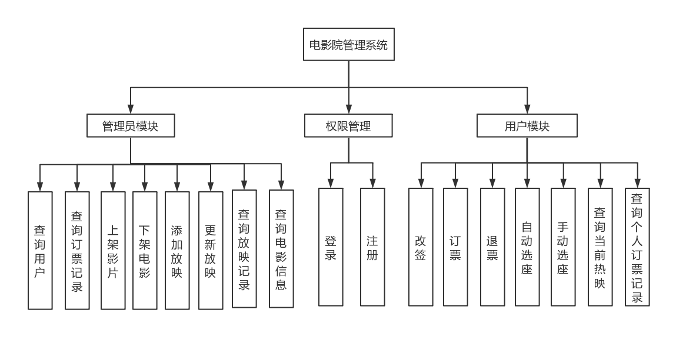
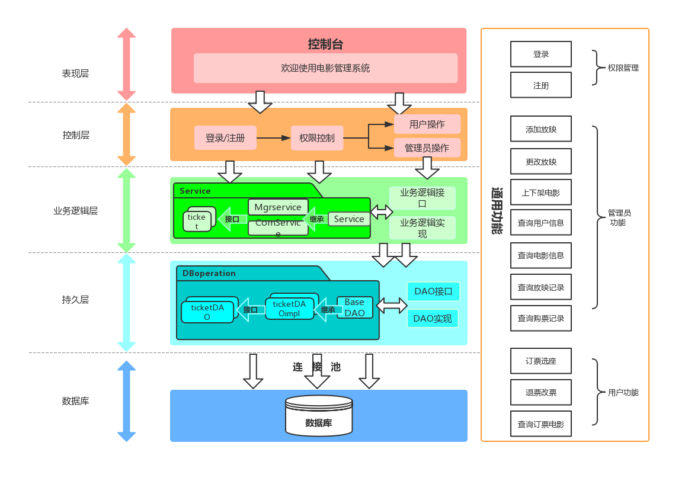
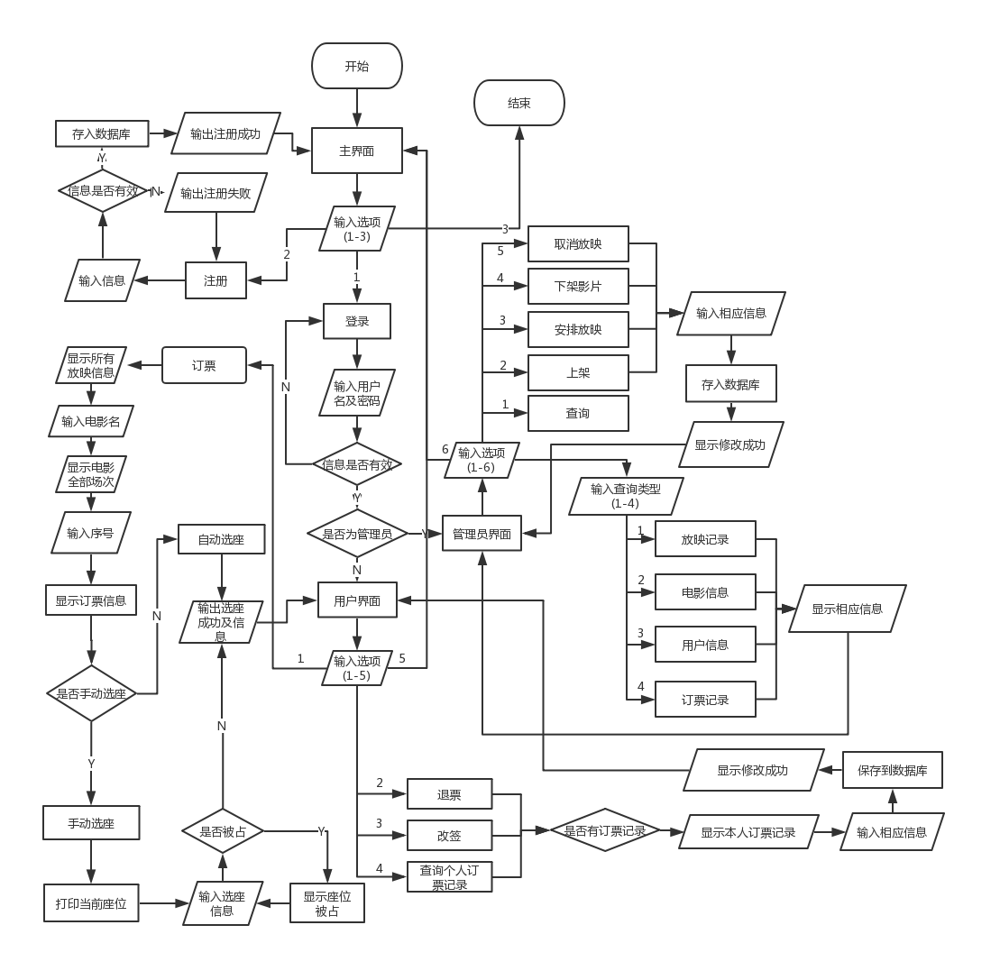
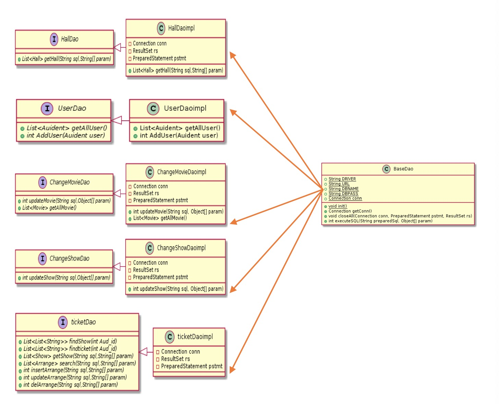
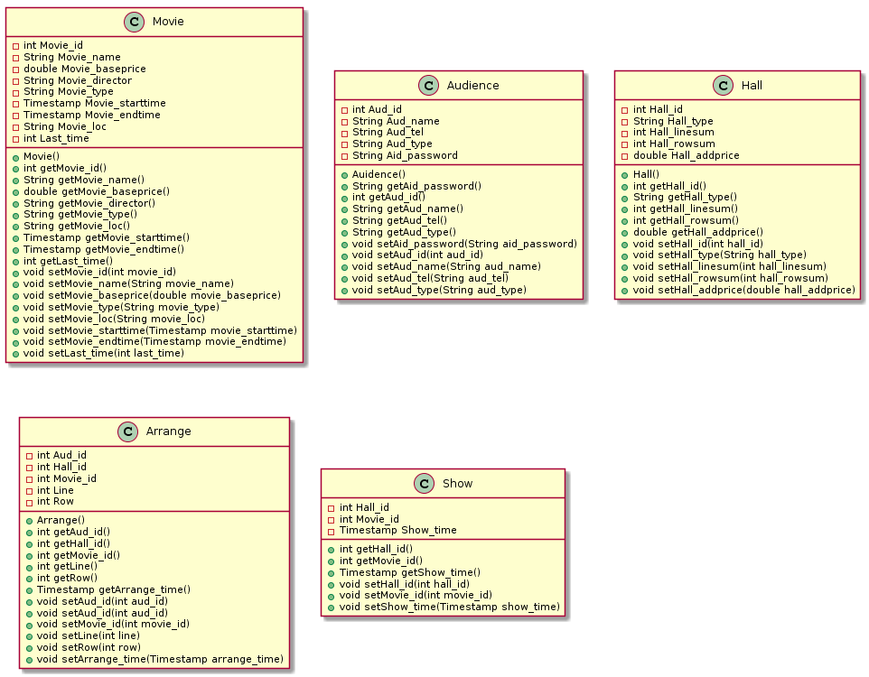
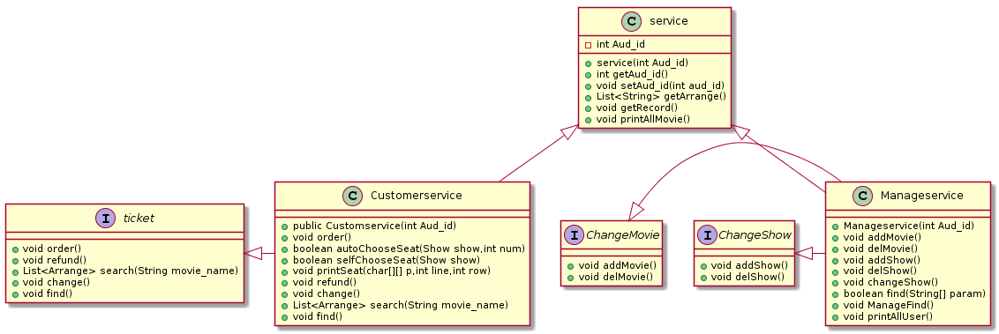
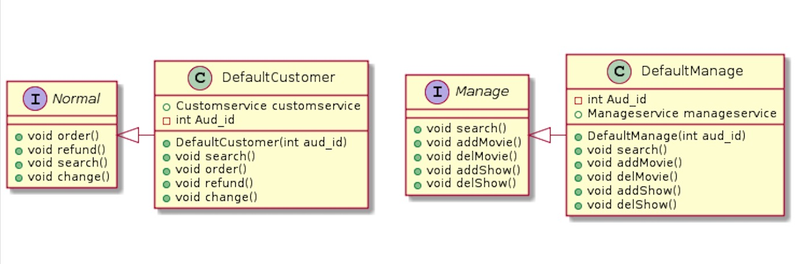
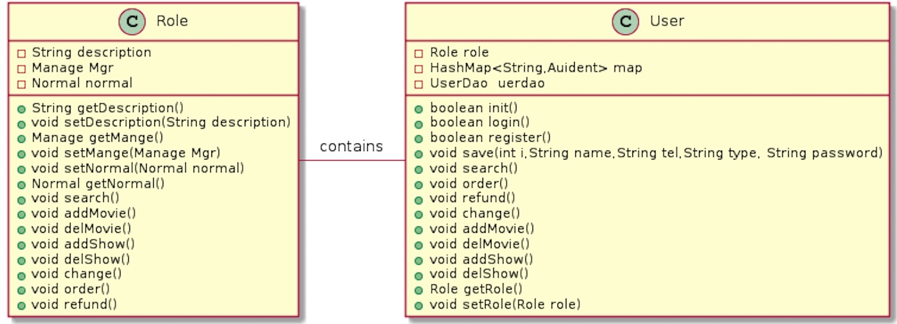

# CinemaManageSystem
项目源自大连理工大学软件学院[Java大作业](JAVA高级编程大作业.pdf)

* 开发环境为  InteliJ IDEA + MYSQL/SQL Server *

# 注意事项
  使用mysql数据库时间存储会差13个小时，因为mysql默认时区是荷兰的，以下是修改方法：
  1. 输入show variables like "%time_zone%";，显示当前时区。
  2. set global time_zone = '+8:00'; 设置全局时间为东八区（+8个小时）。
  3. set time_zone = '+8:00'; 修改当前会话的时区。
  4. flush privileges; 刷新一下使改动立即生效。
  
  最终版本用的是SQL Server,详细介绍见

## 项目简介
本项目实现电影院管理系统的功能，实现了管理员上架/下假影片，安排影片放映，修改/取消放映的功能。管理员还能够查询影片，放映记录，用户选座记录以及所有用户的功能。实现了观众买票选座管理，能够实现自动选座和手工选座两种功能。观众还可以查找到自己的订票记录以及当前热映电影信息。 

## 需求分析
+ 注册功能（只能注册用户）
+ 登录功能（分为管理员登录和用户登录）
+ 管理员/用户权限设计
+ 管理员功能（查询影片及上映信息，影厅管理，上/下架影片，添加/取消放映信息）
+ 用户功能（买票（自动选座和手动选座），退票，改签，按条件查询影片信息）

## 总体设计

### 功能框图
#### 主要分为三个功能模块,权限模块包括登录以及注册功能。管理员模块包括上架电影,下架电影,添加放映信息,更新放映信息,查找用户信息,查找电影信息,查找放映记录,查找订票记录等。用户模块包括订票,自动选座和手动选座,退票, 改签,查找本人订票记录和显示当前热映电影功能。 
#### 权限管理模块支持用户登录以及注册, 通过用户名及密码登录, 确定身份是用户还是 管理员。密码错误最多为 3 次, 多则退出登录界面。注册需要输入对应的信息, 包括用户 名, 密码, 手机号, 密码需要经过确认才能注册成功。 
#### 管理员模块支持上架电影, 下架电影, 添加放映信息, 更新放映信息, 查找用户信息, 查找电影信息, 查找放映记录, 查找订票记录等对于整个系统的增删改查功能。管理员通 过输入对应信息上架电影和添加放映, 输入对应电影名下架电影, 可以显示所有注册过的 用户信息以及他们的订票记录, 可以查找电影的放映记录以及当前电影的信息。在没有 人订票之前可以修改放映信息, 一旦有用户订了该场次的票则不能更新放映信息。 
#### 用户模块支持订票, 自动选座和手动选座, 退票, 改签, 查找本人订票记录和显示当前 热映电影功能 

### 系统分层架构图
我们采用了 JAVA 程序设计课程中介绍的分层架构设计模式, 把整个程序分为了持 久层, 业务逻辑层, 控制层和表现层。

### 流程图

### UML类图
#### DAO类

#### 实体类

#### 服务类

#### 用户类

### 数据库设计
表名|描述|功能说明|
--|:--:|--:
Movie|电影信息表|存储电影信息
MoiveHall|影厅信息表|存储影厅信息
Audience|观众表|存储观众信息
Arrange|订票信息表|存储订票信息
Audience|观众表|存储观众信息

## 设计总结
我们JAVA程序设计课程即将开课了，本课程从JAVA基础语法讲起，采取“基础知识→核心应用→综合案例→企业实践”的结构和“由浅入深，由深到精”的学习模式。不仅介绍Java语言入门、面向对象编程、抽象类与接口、文件操作、泛型集合、多线程和注解等Java语言的基础知识，而且深入讲解Java的JDBC编程、分层架构等核心编程技术，详细探讨Java提供的各种软件开发技术和特性，并且每个部分配合一个综合案例进行演示，以便巩固学习效果。最后讲述软件开发云的企业一线生产环境的使用，把Java语言在华为云DevCloud中的各种应用做了案例展示，全面展现了软件开发云这一新的开发技术在Java学习中的使用方法。

                                                    
                                                    Copyright Dean & Bear©2019
